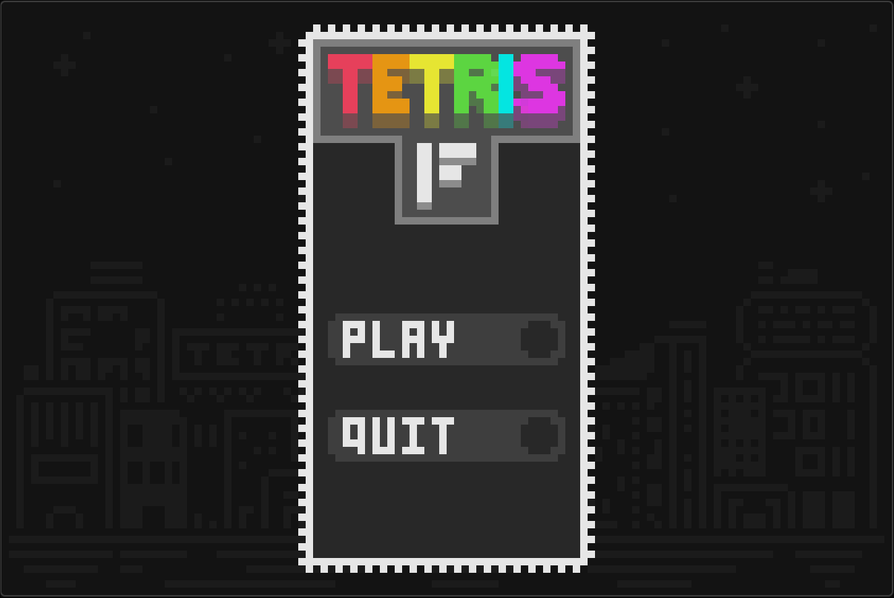
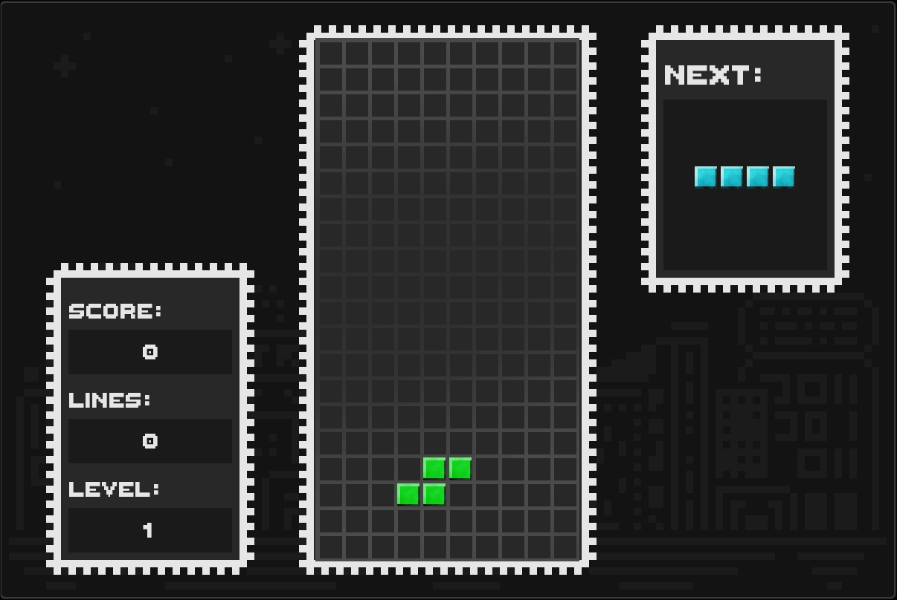
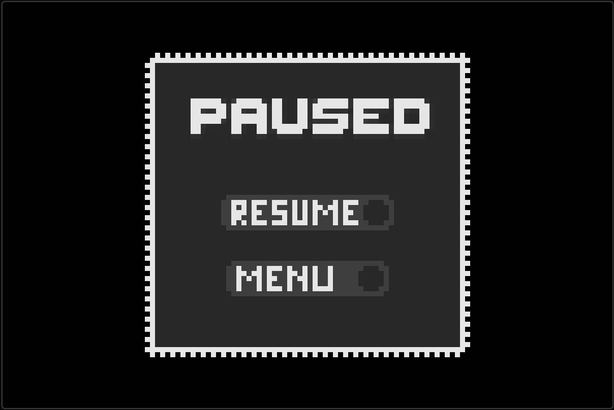

# Tetris FAST Edition 🧱

> ⚠️ **Developer Note:** This game was built as a 2nd-semester school project for my Object-Oriented Programming (OOP) course.

**Tetris FAST Edition** is a custom clone of the classic puzzle game, built from the ground up in modern C++ and SFML 3.

## 🎮 Gameplay / Screenshots

## ✨ Features
* **OOP Architecture:** Heavily utilizes classes, encapsulation, and state management to handle grid logic and Tetromino behavior.
* **Modern C++:** Built utilizing strict C++17 standards and the latest SFML 3 API.
* **Hardware Accelerated:** CPU-optimized compilation (`-march=native`) for maximum performance on any machine.
* **Classic Mechanics:** Full piece rotation, hard drops, and dynamic line-clearing logic.

## ⌨️ Controls
| Action | Input |
| :--- | :--- |
| **Move Left/Right** | `Left / Right Arrow Keys` |
| **Rotate Piece** | `Up Arrow Key` |
| **Quick Placement** | `Down Arrow Key` |
| **Pause Game** | `ESC` |

## 👤 Developer

* **[Your Name]** - Sole developer. This game was built from scratch as a solo project for my 2nd-semester Object-Oriented Programming (OOP) course.
